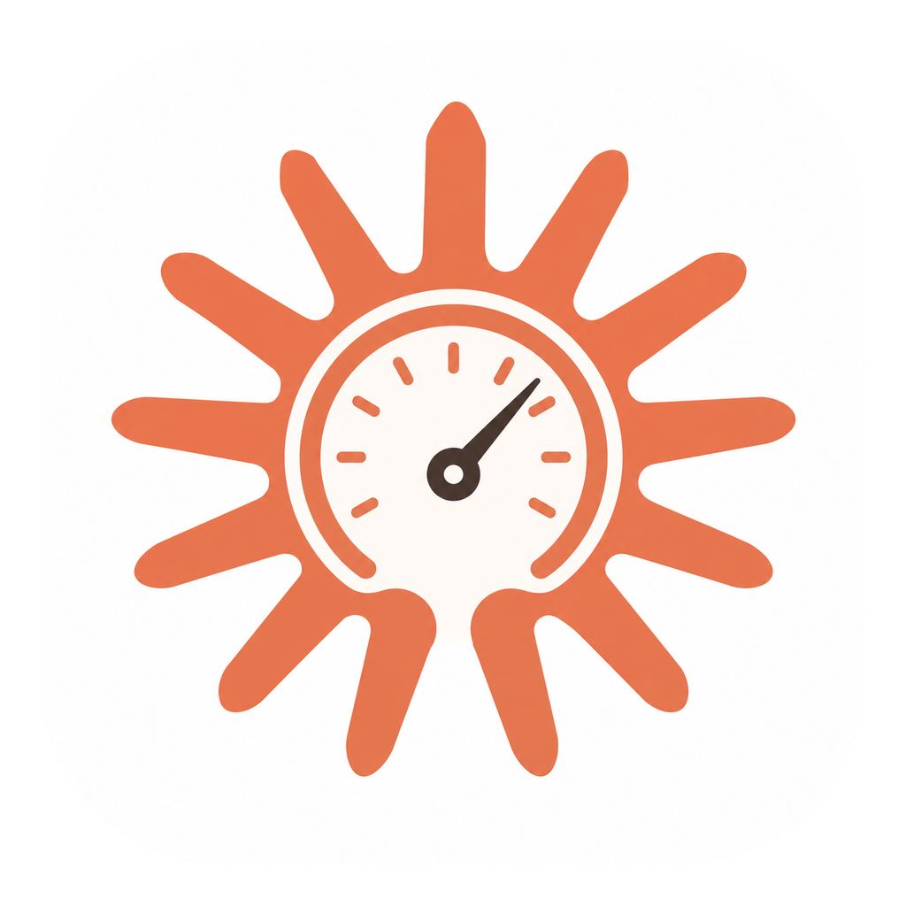

# Claudeometer

A native macOS menu-bar app that shows your **Claude usage** like a battery — live
quota, burn rate, and graduated alerts so you never get surprised by a limit.



```txt
⌁ 62% 🙂        ← in your menu bar, color shifts green → red as you climb
```

## What it does

- **Live quota in the menu bar** — the 5-hour rolling window as a percentage, with a
  mood emoji and a color that gradually shifts from green to red as usage climbs.
- **Detailed popover** — click the menu-bar icon for:
  - the **5-hour window** hero with **burn rate** (`+X%/hr`) and an ETA to full,
  - **7-day**, **Sonnet**, **Opus**, and **OAuth apps** quotas,
  - a **24-hour pace sparkline** (built from locally-stored history),
  - **Claude Code · Hot sessions** — your most token-heavy sessions in the last 5h,
  - extra-usage spend (when enabled).
- **Graduated notifications** — alerts at **50%**, **75%**, **90% (panic)**, and **100%**
  of the 5-hour window, each firing once per window.
- **Local history** — usage snapshots are stored locally for up to 30 days
  (`~/Library/Application Support/Claudeometer/history.json`) and pruned automatically.

Everything stays on your machine. The app sends no telemetry anywhere.

## Install

### Homebrew (recommended)

```sh
brew tap SGSI/claudeometer
brew trust sgsi/claudeometer        # one-time: Homebrew 6.0+ requires trusting third-party taps
brew install --cask claudeometer
```

Homebrew clears the macOS quarantine flag during install, so the app opens with **no
Gatekeeper warning**.

### Direct download

Download the latest `Claudeometer.dmg` from the
[releases page](https://github.com/SGSI/claudeometer/releases/latest), open it, and
drag **Claudeometer** to **Applications**.

The app is not yet signed/notarized, so a raw download triggers macOS Gatekeeper on
first launch. To get past it, run once:

```sh
xattr -dr com.apple.quarantine /Applications/Claudeometer.app
```

…or try to open it, then go to **System Settings → Privacy & Security → Open Anyway**.

On first launch macOS may ask for access to the `Claude Code-credentials` Keychain
item — allow it. If the app says the token is expired, click **Login** (in the `•••`
menu) or run `claude` in a terminal once.

## How it works

Claudeometer reads the OAuth token that **Claude Code** stores in the macOS Keychain
under `Claude Code-credentials`, then calls:

```txt
https://api.anthropic.com/api/oauth/usage
https://api.anthropic.com/api/oauth/profile
```

The token and quota data never leave your machine.

> ⚠️ These Anthropic endpoints are **undocumented** and may change or break at any time.
> Claudeometer is an unofficial tool and is not affiliated with Anthropic.

The "Hot sessions" list and pace history are derived from your local Claude Code logs
in `~/.claude/projects`.

## Team mode (optional)

Claudeometer can also **share and pool Claude usage across your teams**: create or join
teams (public or private, with a name and password), see everyone's live usage on a
per-team board, and **borrow** a teammate's Claude quota for a fixed window when you're
out. Borrowing is scoped to teams you share, and a lent credential is **end-to-end
encrypted** to the borrower — the relay only ever brokers opaque ciphertext and never
sees a token.

Team mode talks to a small **self-hosted relay** (`relay/` — a Go + SQLite service; see
`relay/PROTOCOL.md`). The relay URL is deliberately **not** baked into this repo. Point
the app at your own relay with either:

- an environment variable: `CLAUDEOMETER_RELAY_URL=http://your-relay:8080`, or
- a one-line file at `~/Library/Application Support/Claudeometer/relay-url` containing the URL.

With neither set, Claudeometer stays a personal usage meter — no team prompts, no network.

**Don't want to host your own relay?** Reach out and I'll share mine — connect with me on
LinkedIn or email **sanketwable123@gmail.com**, and I'll send you a hosted relay URL to
point the app at.

## Build from source

Requirements: macOS 13+ and a recent Swift toolchain (Xcode 16+).

```sh
chmod +x scripts/build-app.sh
./scripts/build-app.sh
open build/Claudeometer.app
```

The app bundle is produced at `build/Claudeometer.app`.

## License

[MIT](LICENSE) © 2026 SGSI
